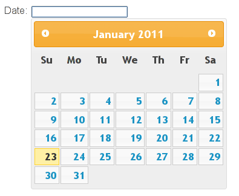
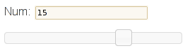
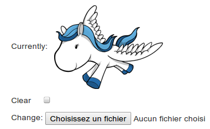

Example widgets
===============

A date picker
-------------

This snippet implements a rich date picker using the browser's date picker if
the ``date`` input type is supported and falls back to a jQuery UI date
picker.

.. code-block:: python

    # forms.py
    import floppyforms as forms

    class DatePicker(forms.DateInput):
        template_name = 'datepicker.html'

        class Media:
            js = (
                'js/jquery.min.js',
                'js/jquery-ui.min.js',
            )
            css = {
                'all': (
                    'css/jquery-ui.css',
                )
            }

    class DateForm(forms.Form):
        date = forms.DateField(widget=DatePicker)

.. code-block:: jinja

    {# datepicker.html #}
    

    

Here is how chromium renders it with its native (but sparse) date picker:

And here is the jQuery UI date picker as shown by Firefox:

An autofocus input
------------------

A text input with the autofocus attribute and a fallback for browsers that
doesn't support it.

.. code-block:: python

    # forms.py
    import floppyforms as forms

    class AutofocusInput(forms.TextInput):
        template_name = 'autofocus.html'

        def get_context_data(self):
            self.attrs['autofocus'] = True
            return super(AutofocusInput, self).get_context_data()

    class AutofocusForm(forms.Form):
        text = forms.CharField(widget=AutofocusInput)

.. code-block:: jinja

    {# autofocus.html #}
    

    

A slider
--------

A ``range`` input that uses the browser implementation or falls back to
jQuery UI.

.. code-block:: python

    # forms.py
    import floppyforms as forms

    class Slider(forms.RangeInput):
        min = 5
        max = 20
        step = 5
        template_name = 'slider.html'

        class Media:
            js = (
                'js/jquery.min.js',
                'js/jquery-ui.min.js',
            )
            css = {
                'all': (
                    'css/jquery-ui.css',
                )
            }

    class SlideForm(forms.Form):
        num = forms.IntegerField(widget=Slider)

        def clean_num(self):
            num = self.cleaned_data['num']
            if not 5 <= num <= 20:
                raise forms.ValidationError("Enter a value between 5 and 20")

            if not num % 5 == 0:
                raise forms.ValidationError("Enter a multiple of 5")
            return num

.. code-block:: jinja

    {# slider.html #}
    
    

    

Here is how chromium renders it with its native slider:

And here is the jQuery UI slider as shown by Firefox:

A placeholder with fallback
---------------------------

An ``<input>`` with a ``placeholder`` attribute and a javascript fallback for
broader browser support.

.. code-block:: python

    # forms.py
    import floppyforms as forms

    class PlaceholderInput(forms.TextInput):
        template_name = 'placeholder_input.html'

    class MyForm(forms.Form):
        text = forms.CharField(widget=PlaceholderInput(
            attrs={'placeholder': _('Some text here')},
        ))

.. code-block:: jinja

    {# placeholder_input.html #}

    

    

An image clearable input with thumbnail
---------------------------------------

If we have an image set for the field, display the image and propose to clear or to update.

.. code-block:: python

    # forms.py
    import floppyforms as forms

    class ImageThumbnailFileInput(forms.ClearableFileInput):
        template_name = 'floppyforms/image_thumbnail.html'

    class ImageForm(forms.ModelForm):
        class Meta:
            model = Item
            fields = ('image',)
            widgets = {'image': ImageThumbnailFileInput}

.. code-block:: django

    {# image_thumbnail.html #}
    
     
    
    
<input type="checkbox" name="{{ checkbox_name }}" id="{{ checkbox_id }}">
    <label for="{{ checkbox_id }}"></label>

	 
    
    
    
    <input type="{{ type }}" name="{{ name }}" required>

You now have your image:

