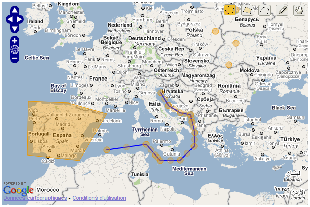
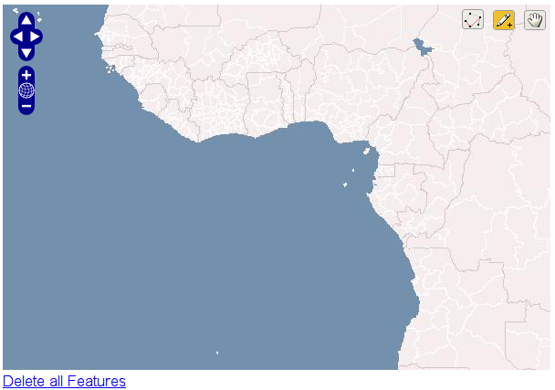
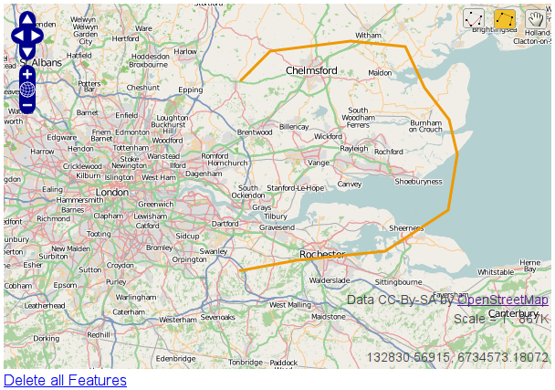
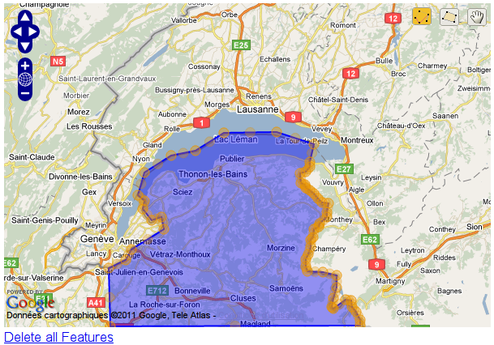

GeoDjango widgets
=================



django-floppyforms provides fields and rich widgets for easy manipulation of
GEOS geometry fields. All geometry types are supported thanks to OpenLayers
and a custom WKT parser/serializer implementing some Django-specific tweaks.

.. note::

    Since GeoDjango doesn't provide any rich widget out of the box (except for
    the admin), the API described here is not trying to look like any existing
    API in GeoDjango.

    The geographic fields and widgets are provided under the
    ``floppyforms.gis`` namespace.

Setting up
----------

To make sure you're ready to use the geographic widgets, follow the
`installation instructions for GeoDjango`_ closely. You need to have
``'django.contrib.gis'`` in your ``INSTALLED_APPS`` setting.

Next, you need to serve the javascript library provided by django-floppyforms
(located in ``floppyforms/static/floppyforms/js/MapWidget.js``).

You might want to use ``django.contrib.staticfiles``, so that the javascript
library will be picked up automatically and gets served by the development
server. Just make sure you run ``manage.py collectstatic`` once you deploy
your project.

.. _installation instructions for GeoDjango: https://docs.djangoproject.com/en/dev/ref/contrib/gis/install/

Widget types
------------

django-floppyforms provides **base widgets** and **geometry-specific
widgets**:

* **base widgets** are in charge of rendering a map from a specific map
  provider (Metacarta, Google Maps, OpenStreetMap…). They are not aware of the
  type of geometry, they need to be complemented by geometry-specific widgets.
* **geometry-specific widgets** are here to make base widgets aware of the
  type of geometry to edit: is the geometry a point? A polygon? A collection?
  Geometry-specific widgets provides these information so that the
  corresponding controls are activated.

To get a fully working geometry widget, you need to define a class that
inherits from a base widget (to specify the map provider) and a
geometry-specific widget (to specify the type of geometry you want to create).
Here is a quick example:

.. code-block:: python

    import floppyforms as forms

    class PointWidget(forms.gis.PointWidget, forms.gis.BaseOsmWidget):
        pass

Here ``BaseOsmWidget`` is the base widget (i.e. I want to see an
OpenStreetMap) and ``PointWidget`` is the geometry-specific widget (i.e. I
want to draw a point on the map).

Base Widgets
````````````

The following base widgets are provided:

* ``BaseMetacartaWidget``: this base widget renders a map using the `Vector
  Level 0`_ map from `Metacarta`_.

.. _Vector Level 0: http://earth-info.nga.mil/publications/vmap0.html
.. _Metacarta: http://metacarta.com/

* ``BaseOsmWidget``: this base widget renders a map using `OpenStreetMap`_.

.. _OpenStreetMap: http://www.openstreetmap.org/

* ``BaseGMapWidget``: this base widget renders a map using the Google Maps
  API. It uses the v3 javascript API and requires an API Key (which can be
  obtained at `Google Developers`_). Subclasses must set the attribute
  ``google_maps_api_key``, otherwise the map will fail to load.

.. _Google Developers: https://developers.google.com/maps/documentation/javascript/get-api-key

.. code-block:: python

    import floppyforms as forms

    class PointWidget(forms.gis.PointWidget, forms.gis.BaseGMapWidget):
        google_maps_api_key = 'YOUR-GOOGLE-MAPS-API-KEY-HERE'

Geometry-specific widgets
`````````````````````````

For each geographic model field, here are the corresponding form fields and
form widgets provided by django-floppyforms:

======================= ======================= ========================
GeoDjango model field   Floppyforms form field  Floppyforms form widget
======================= ======================= ========================
PointField              PointField              PointWidget
MultiPointField         MultiPointField         MultiPointWidget
LineStringField         LineStringField         LineStringWidget
MultiLineStringField    MultiLineStringField    MultiLineStringWidget
PolygonField            PolygonField            PolygonWidget
MultiPolygonField       MultiPolygonField       MultiPolygonWidget
GeometryField           GeometryField           GeometryWidget
GeometryCollectionField GeometryCollectionField GeometryCollectionWidget
======================= ======================= ========================

Each form field has a default form widget, using the corresponding
geometry-specific widget and the Metacarta base widget. A form defined using
nothing more than floppyforms fields will be displayed using the Metacarta WMS
map service. For instance:

.. code-block:: python

    # forms.py
    import floppyforms as forms

    class GeoForm(forms.Form):
        point = forms.gis.PointField()

.. code-block:: jinja

    {# template.html #}
    <html>
      <head>
        {{ form.media }}
      </head>
      <body>
        <form method="post" action="/some-url/">
          
          {{ form.as_p }}
          <p><input type="submit" value="Submit"></p>
        </form>
      </body>
    </html>

And the result will looks like this:



Customization
-------------

The philosophy of this widgets library is to avoid building a complex layer of
abstraction that would generate some javascript / OpenLayers code out of
Python class attributes or methods. Everything that can be done in the
template or JavaScript code should be done there.

Therefore there are few options to customize the map on the widget classes.
Only basic customization can be made in python, the rest should be done in the
templates using the JavaScript library.

Widget attributes and arguments
```````````````````````````````

The following attributes can be set on the widget class:

* ``map_width``: the width of the map, in pixels. Default: 600.

* ``map_height``: the height of the map, in pixels. Default: 400.

* ``map_srid``: the SRID to use on the map. When existing geometries are
  edited, they are transformed to this SRID. The javascript code doesn't
  transform geometries so it's important to set this to the SRID used with
  your map provider. Default: 4326.

* ``display_wkt``: whether to show the ``textarea`` in which the geometries
  are serialized. Usually useful for debugging. Default: ``False``.

These options can be set as class attributes or passed into the ``attrs``
dictionnary used when instantiating a widget. The following snippets are
equivalent:

.. code-block:: python

    import floppyforms as forms

    class OsmPointWidget(forms.gis.PointWidget, forms.gis.BaseOsmWidget):
        pass

    class CustomPointWidget(OsmPointWidget):
        map_width = 1000
        map_height = 700

    class GeoForm(forms.Form):
        point = forms.gis.PointField(widget=CustomPointWidget)

and:

.. code-block:: python

    import floppyforms as forms

    class OsmPointWidget(forms.gis.PointWidget, forms.gis.BaseOsmWidget):
        pass

    class GeoForm(forms.Form):
        point = forms.gis.PointField(widget=OsmPointWidget(attrs={
            'map_width': 1000,
            'map_height': 700,
        }))

Of course, the traditional ``template_name`` class attribute is also
supported.

Template context
````````````````

The following variables are available in the template context:

* ``ADMIN_MEDIA_PREFIX``: this setting, yes. It's useful to display some icons
  that are missing in OpenLayers. **Deprecated, please switch to use the
  staticfiles machinery**
* ``LANGUAGE_BIDI``: the current locale direction.
* ``attrs``: the traditional attrs dictionnary. This is the attrs dict for a
  ``textarea`` widget, it contains the ``id``, ``cols`` and ``rows``
  attributes.
* ``display_wkt``: the value from the widget class.
* ``geom_type``: the OGR geometry type for the geometry being edited.
* ``hidden``: set to ``False``, textareas can't be hidden.
* ``is_collection``: whether the geometry is a collection.
* ``is_linestring``: whether the geometry is a line string.
* ``is_point``: whether the geometry is a point.
* ``is_polygon``: whether the geometry is a polygon.
* ``map_width``: the width, from the class attribute.
* ``map_height``: the height, from the class attribute.
* ``map_srid``: the SRID, from the class attribute.
* ``module``: the name to use for the javascript object that contains the map.
* ``name``: the name of the field.
* ``required``: True if the field is required.
* ``type``: the input type, ``None`` in this case.
* ``value``: the WKT serialization of the geometry, expressed in the
  projection defined by ``map_srid``.

Javascript library
``````````````````

The javascript library provided by django-floppyforms relies on OpenLayers.
It creates a map container based on a series of options. A minimal widget can
be created like this:

.. code-block:: javascript

    var options = {
        geom_type: OpenLayers.Geometry.Point,
        id: 'id_point',
        is_point: true,
        map_id: 'point_map',
        name: 'My awesome point'
    };
    var point_map = new MapWidget(options);

With these options, you need in your HTML code a ``<textarea id="id_point">``
and an empty ``<div id="point_map">``. The size of the map can be set by
styling the div with CSS.

Generally you don't have to touch the ``geom_type``, ``id``, ``is_point``,
``map_id`` and ``name`` attributes: django-floppyforms generates them for you.
However, the template structure makes it easy to specify some custom options.
The base template defines a ``map_options`` and an ``options`` block. They can
be altered like this (let's say we want to re-implement the Google Maps base
widget):

.. code-block:: python

    # forms.py
    from django.template.defaultfilters import safe
    import floppyforms as forms

    class BaseGMapWidget(forms.gis.BaseGeometryWidget):
        map_srid = 900913  # Use the google projection
        template_name = 'forms/google_map.html'

        class Media:
            js = (
                'http://openlayers.org/dev/OpenLayers.js',
                'floppyforms/js/MapWidget.js',

                # Needs safe() because the ampersand (&):
                safe('http://maps.google.com/maps/api/js?'
                     'v=3&key=YOUR-GOOGLE-MAPS-API-KEY-HERE'),
            )

Here we need the development version of OpenLayers because OpenLayers 2.10
doesn't implement version 3 of the Google Maps API. We also specify that we're
using the google projection.

.. code-block:: jinja

    {# forms/google_map.html #}
    

    
    {{ block.super }}
    options['base_layer'] = new OpenLayers.Layer.Google("Google Streets",
                                                        {numZoomLevels: 20,
                                                         units: 'm'});
    options['point_zoom'] = 14;
    

Calling ``block.super`` generates the options dictionary with all the
required options. We can then safely alter it at will. In this case we can
directly add an OpenLayers.Layer instance to the map options and it will be
picked up as a base layer.

The following options can be passed to the widget constructor:

* ``base_layer``: an OpenLayers.Layer instance (or an instance of a subclass)
  that will be used as a base layer for the map. Default: Metacarta's base WMS
  layer.
* ``color``: the color of the features drawn on the map. Default:
  ``'ee9900'``.
* ``default_lon``: the default longitude to center the map on if there is no
  feature. Default: 0.
* ``default_lat``: the default latitude to center the map on if there is no
  feature. Default: 0.
* ``default_zoom``: the default zoom level to use when there is no feature.
  Default: 4.
* ``geom_type``: an OpenLayers.Geometry.* class name.
* ``id``: the id of the textarea to whih the feature is serialized.
* ``is_collection``: whether the feature to draw is a collection. Default:
  false.
* ``is_linestring``: whether the feature to draw is a linestring. Default:
  false.
* ``is_point``: whether the feature to draw is a point. Default: false.
* ``is_polygon``: whether the feature to draw is a polygon. Default: false.
* ``layerswitcher``: whether to show OpenLayers' layerswitcher control.
  Default: false.
* ``map_id``: the id of the div containing the map.
* ``map_options``: a dictionnary for the options passed to the OpenLayers.Map
  constructor. Default: {}.
* ``map_srid``: the SRID to use for the map. Default: 4326.
* ``modifiable``: whether the feature can be modifiable or not. Default: true.
* ``mouse_position``: whether to show the coordinates of the mouse on the side
  of the map. Default: false.
* ``name``: the name of the layer containing the feature to draw.
* ``opacity``: the opacity of the inner parts of the drawn features (mostly,
  polygons). Default: 0.4.
* ``point_zoomm``: the zoom level to set when a map is displayed with a single
  point on it. For other feature types, the map is focused automatically on
  the feature. Default: 12.
* ``scale_text``: whether to show the scale information on the side of the
  map. Default: false.
* ``scrollable``: if set to false, the user won't be able to scroll to zoom in
  and out.

There is also a ``map_options`` block that can be overridden. Its purpose is
to declare a ``map_options`` dictionnary that can be passed to the
``OpenLayers.Map`` constructor. For instance:

.. code-block:: jinja

    
    var map_options = {
        maxExtend: new OpenLayers.Bounds(-20037508,-20037508,20037508,20037508),
        maxResolution: 156543.0339,
        numZoomLevels: 20,
        units: 'm'
    };
    

Here we don't need to call ``block.super`` since the base template only
instantiates an empty dictionnary.

Going further
`````````````

If the options or the map options don't give you enough flexibility, you can,
not necessarily in that order:

* Redefine the template structure, based on the default OpenLayers template.
* Extend the MapWidget javascript library.

In either way, digging into floppyforms' code (templates, widgets, javascript
lib) is more than encouraged. Of course, if you end up implementing additional
base widgets for new map providers, feel free to `contribute them back!`_

If you need a custom base widget, it is important to inherit from
``floppyforms.gis.BaseGeometryWidget``: if you inherit from an existing base
widget, you may end up with conflicting media files. ``BaseGeometryWidget``
doesn't specify any javascript file so get more control by subclassing it.

.. _contribute them back!: https://github.com/gregmuellegger/django-floppyforms

Examples
--------

OpenStreetMap
`````````````

.. code-block:: python

    # forms.py
    import floppyforms as forms

    class OsmLineStringWidget(forms.gis.BaseOsmWidget,
                              forms.gis.LineStringWidget):
        pass

    class OsmForm(forms.Form):
        line = forms.gis.LineStringField(widget=OsmLineStringWidget)

Result:



Google Maps
```````````

.. code-block:: python

    # forms.py
    import floppyforms as forms

    class GMapPolygonWidget(forms.gis.BaseGMapWidget,
                            forms.gis.PolygonWidget):
        google_maps_api_key = 'YOUR-GOOGLE-MAPS-API-KEY-HERE'

    class GmapForm(forms.Form):
        poly = forms.gis.PolygonField(widget=GMapPolygonWidget)

Result:


